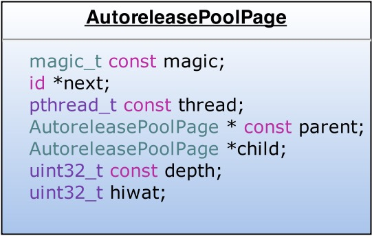
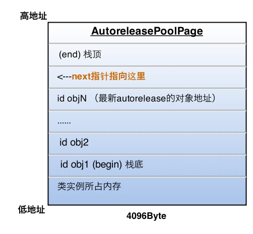

# Autorelease

* Autorelease对象什么时候释放？

> 在没有手加Autorelease Pool的情况下，Autorelease对象是在当前的runloop迭代结束时释放的，而它能够释放的原因是系统在每个runloop迭代中都加入了自动释放池Push和Pop

* AutoreleasePoolPage




> * AutoreleasePool并没有单独的结构，而是由若干个AutoreleasePoolPage以双向链表的形式组合而成（分别对应结构中的parent指针和child指针）
> * AutoreleasePool是按线程一一对应的（结构中的thread指针指向当前线程）
> * AutoreleasePoolPage每个对象会开辟4096字节内存（也就是虚拟内存一页的大小），除了上面的实例变量所占空间，剩下的空间全部用来储存autorelease对象的地址
> * 上面的id *next指针作为游标指向栈顶最新add进来的autorelease对象的下一个位置
> * 一个AutoreleasePoolPage的空间被占满时，会新建一个AutoreleasePoolPage对象，连接链表，后来的autorelease对象在新的page加入
> * 向一个对象发送- autorelease消息，就是将这个对象加入到当前AutoreleasePoolPage的栈顶next指针指向的位置

若当前线程中只有一个AutoreleasePoolPage对象，并记录了很多autorelease对象地址时内存如下图：



### objc_autoreleasePoolPush & objc_autoreleasePoolPop

* 每当进行一次objc_autoreleasePoolPush调用时，runtime向当前的AutoreleasePoolPage中add进一个哨兵对象，值为0（也就是个nil）


* objc_autoreleasePoolPush的返回值正是这个哨兵对象的地址，被objc_autoreleasePoolPop(哨兵对象)作为入参，于是：
    1. 根据传入的哨兵对象地址找到哨兵对象所处的page
    2. 在当前page中，将晚于哨兵对象插入的所有autorelease对象都发送一次- release消息，并向回移动next指针到正确位置
    3. 补充2：从最新加入的对象一直向前清理，可以向前跨越若干个page，直到哨兵所在的page


### 黑魔法之Thread Local Storage

Thread Local Storage(TLS)线程局部存储，目的很简单，将一块内存作为某个线程专有的存储，以key-value的形式进行读写。比如在非arm架构下，使用pthread提供的方法实现:

```
void* pthread_getspecific(pthread_key_t);
int pthread_setspecific(pthread_key_t , const void *);
```
在返回值身上调用`objc_autoreleaseReturnValue`方法时，runtime将这个返回值储存在TLS中，然后直接返回这个对象(不调用autorelease);同时，在外部接收这个返回值的`objc_retainAutoreleasedReturnValue`里，发现TLS中正好存了这个对象，那么直接返回这个对象(不调用retain)。
于是，调用方和被调用方利用TLS做中转，很有默契的免去了对返回值的内存管理。

-
相关链接
[黑幕背后的Autorelease](http://blog.sunnyxx.com/2014/10/15/behind-autorelease/)


