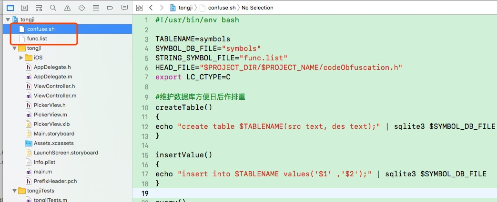

# iOS代码混淆

1. 示例

* code url : `https://github.com/cAibDe/CodeConfusion`
* artilce url : `https://mp.weixin.qq.com/s/94EQ7aL6CloX5XNyLqIlOQ`

2. 原理分析

    * confuse.sh脚本，根据func.list定义好的需要混淆的属性和方法列表，循环读取并逐个生成一个对应的混淆后的字符串，并最终将结果输出到codeObfuscation.h头文件中。
    * 在pch文件中引入codeObfuscation.h文件，在编译时，xcode对func.list定义的属性和方法列表进入宏替换，达到代码混淆的目的。
    

