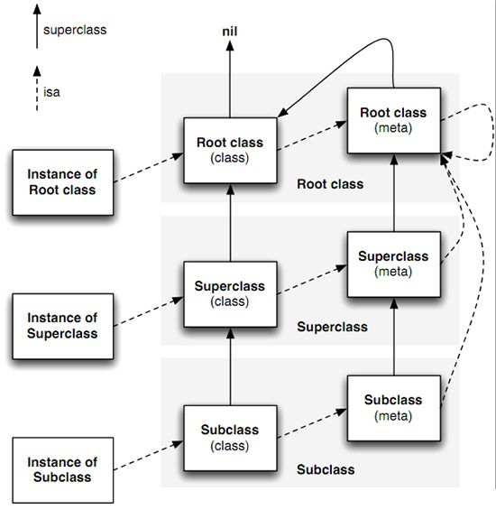

1. 获取类 `objc_getClass`
2. 获取元类 `object_getClass`
3. _objc_msgForward

-
* NSMethodSignature、selector、Method、

-

* isa & superclass
    

* 类对象(objc_class)是由程序员定义并在运行时由编译器创建的，它没有自己的实例变量，这里需要注意的是==类的成员变量和实例方法列表是属于实例对象的，但其存储于类对象当中的==。
    
    ```
    // 获取类的类名
    const char * class_getName ( Class cls ); 
    // 创建一个新类和元类
    Class objc_allocateClassPair ( Class superclass, const char *name, size_t extraBytes ); //如果创建的是root class，则superclass为Nil。extraBytes通常为0
    
    // 销毁一个类及其相关联的类
    void objc_disposeClassPair ( Class cls ); //在运行中还存在或存在子类实例，就不能够调用这个。
    
    // 在应用中注册由objc_allocateClassPair创建的类
    void objc_registerClassPair ( Class cls ); //创建了新类后，然后使用class_addMethod，class_addIvar函数为新类添加方法，实例变量和属性后再调用这个来注册类，再之后就能够用了。
    ```

* 实例对象(objc_object)是我们对类对象alloc或者new操作时所创建的，==在这个过程中会拷贝实例所属的类的成员变量，但并不拷贝类定义的方法==。


```
/// Represents an instance of a class.
struct objc_object {
    Class _Nonnull isa  OBJC_ISA_AVAILABILITY;
};
```


```
// 返回给定对象的类名
const char * object_getClassName ( id obj );
// 返回对象的类
Class object_getClass ( id obj );
// 设置对象的类
Class object_setClass ( id obj, Class cls );
// 获取已注册的类定义的列表
int objc_getClassList ( Class *buffer, int bufferCount );

// 创建并返回一个指向所有已注册类的指针列表
Class * objc_copyClassList ( unsigned int *outCount );

// 返回指定类的类定义
Class objc_lookUpClass ( const char *name );
Class objc_getClass ( const char *name );
Class objc_getRequiredClass ( const char *name );

// 返回指定类的元类
Class objc_getMetaClass ( const char *name );
// 创建类实例
id class_createInstance ( Class cls, size_t extraBytes ); //会在heap里给类分配内存。这个方法和+alloc方法类似。

// 在指定位置创建类实例
id objc_constructInstance ( Class cls, void *bytes ); 

// 销毁类实例
void * objc_destructInstance ( id obj ); //不会释放移除任何相关引用
```

* 元类(Metaclass)就是类对象的类，每个类都有自己的元类，也就是objc_class结构体里面isa指针所指向的类. Objective-C的类方法是使用元类的根本原因，因为其中存储着对应的类对象调用的方法即类方法。
* 在给实例对象或类对象发送消息时，寻找方法列表的规则为:
    * 当发送消息给实例对象时，消息是在寻找这个对象的类的方法列表(实例方法)
    * 当发送消息给类对象时，消息是在寻找这个类的元类的方法列表(类方法)
* 所有的元类都使用根元类作为他们的类，根元类的元类则就是它自己，也就是说基类的元类的isa指针指向他自己。

    ```
    // 获取类的父类
    Class class_getSuperclass ( Class cls );
    // 判断给定的Class是否是一个meta class
    BOOL class_isMetaClass ( Class cls );
    // 获取实例大小
    size_t class_getInstanceSize ( Class cls );
    ```
* 属性是添加了存取方法的成员变量，也就是:`@property = ivar + getter + setter;`,系统会在objc_ivar_list中添加一个成员变量的描述，然后在methodLists中分别添加setter和getter方法的描述。


```
//遍历获取所有属性Property
- (void) getAllProperty {
    unsigned int propertyCount = 0;
    objc_property_t *propertyList = class_copyPropertyList([Person class], &propertyCount);
    for (unsigned int i = 0; i < propertyCount; i++ ) {
        objc_property_t *thisProperty = propertyList[i];
        const char* propertyName = property_getName(*thisProperty);
        NSLog(@"Person拥有的属性为: '%s'", propertyName);
    }
}
```

* 成员变量
    * Ivar: 实例变量类型，是一个指向objc_ivar结构体的指针
    
    
```
/// An opaque type that represents an instance variable.
typedef struct objc_ivar *Ivar;

- struct objc_ivar {
    char * _Nullable ivar_name                               OBJC2_UNAVAILABLE;
    char * _Nullable ivar_type                               OBJC2_UNAVAILABLE;
    int ivar_offset                                          OBJC2_UNAVAILABLE;
#ifdef __LP64__
    int space                                                OBJC2_UNAVAILABLE;
#endif
}   
```


```
//成员变量操作函数
// 修改类实例的实例变量的值
Ivar object_setInstanceVariable ( id obj, const char *name, void *value );
// 获取对象实例变量的值
Ivar object_getInstanceVariable ( id obj, const char *name, void **outValue );
// 返回指向给定对象分配的任何额外字节的指针
void * object_getIndexedIvars ( id obj );
// 返回对象中实例变量的值
id object_getIvar ( id obj, Ivar ivar );
// 设置对象中实例变量的值
void object_setIvar ( id obj, Ivar ivar, id value );


// 获取类成员变量的信息
Ivar class_getClassVariable ( Class cls, const char *name );
// 添加成员变量
BOOL class_addIvar ( Class cls, const char *name, size_t size, uint8_t alignment, const char *types ); //这个只能够向在runtime时创建的类添加成员变量
// 获取整个成员变量列表
Ivar * class_copyIvarList ( Class cls, unsigned int *outCount ); //必须使用free()来释放这个数组
```

用法举例

```
//遍历获取Person类所有的成员变量IvarList
- (void) getAllIvarList {
    unsigned int methodCount = 0;
    Ivar * ivars = class_copyIvarList([Person class], &methodCount);
    for (unsigned int i = 0; i < methodCount; i ++) {
        Ivar ivar = ivars[i];
        const char * name = ivar_getName(ivar);
        const char * type = ivar_getTypeEncoding(ivar);
        NSLog(@"Person拥有的成员变量的类型为%s，名字为 %s ",type, name);
    }
    free(ivars);
}
```

* 方法
    * Method 代表类中某个方法的类型
    * 方法名类型为 SEL
    * 方法类型 method_types 是个 char 指针，存储方法的参数类型和返回值类型
    * method_imp 指向了方法的实现，本质是一个函数指针
    * IMP:实际上就是一个函数指针，指向方法实现的首地址
        
        
```
// An opaque type that represents a method in a class definition.
typedef struct objc_method *Method;

struct objc_method {
    SEL _Nonnull method_name                                 OBJC2_UNAVAILABLE;
    char * _Nullable method_types                            OBJC2_UNAVAILABLE;
    IMP _Nonnull method_imp                                  OBJC2_UNAVAILABLE;
}
```

操作函数


```
// 调用指定方法的实现，返回的是方法实现时的返回，参数receiver不能为空，这个比method_getImplementation和method_getName快
id method_invoke ( id receiver, Method m, ... );
// 调用返回一个数据结构的方法的实现
void method_invoke_stret ( id receiver, Method m, ... );
// 获取方法名，希望获得方法明的C字符串，使用sel_getName(method_getName(method))
SEL method_getName ( Method m );
// 返回方法的实现
IMP method_getImplementation ( Method m );
// 获取描述方法参数和返回值类型的字符串
const char * method_getTypeEncoding ( Method m );
// 获取方法的返回值类型的字符串
char * method_copyReturnType ( Method m );
// 获取方法的指定位置参数的类型字符串
char * method_copyArgumentType ( Method m, unsigned int index );
// 通过引用返回方法的返回值类型字符串
void method_getReturnType ( Method m, char *dst, size_t dst_len );
// 返回方法的参数的个数
unsigned int method_getNumberOfArguments ( Method m );
// 通过引用返回方法指定位置参数的类型字符串
void method_getArgumentType ( Method m, unsigned int index, char *dst, size_t dst_len );
// 返回指定方法的方法描述结构体
struct objc_method_description * method_getDescription ( Method m );
// 设置方法的实现
IMP method_setImplementation ( Method m, IMP imp );
// 交换两个方法的实现
void method_exchangeImplementations ( Method m1, Method m2 );
```

* 方法列表
    * 方法调用是通过查询对象的isa指针所指向归属类中的methodLists来完成。

    
```
// 添加方法
BOOL class_addMethod ( Class cls, SEL name, IMP imp, const char *types ); //和成员变量不同的是可以为类动态添加方法。如果有同名会返回NO，修改的话需要使用method_setImplementation

// 获取实例方法
Method class_getInstanceMethod ( Class cls, SEL name );

// 获取类方法
Method class_getClassMethod ( Class cls, SEL name );

// 获取所有方法的数组
Method * class_copyMethodList ( Class cls, unsigned int *outCount );

// 替代方法的实现
IMP class_replaceMethod ( Class cls, SEL name, IMP imp, const char *types );

// 返回方法的具体实现
IMP class_getMethodImplementation ( Class cls, SEL name );
IMP class_getMethodImplementation_stret ( Class cls, SEL name );

// 类实例是否响应指定的selector
BOOL class_respondsToSelector ( Class cls, SEL sel );
```

#### 方法调用流程

1. 方法调用流程
    1. 检查 selector 是否需要忽略
    2. 检查 target 是否为 nil，如果是 nil 就直接 cleanup，然后 return
    3. 在 target 的 Class 中根据 selector 去找 IMP

2. 寻找 IMP 的过程:
    1. 在当前 class 的方法缓存里寻找（cache methodLists）
    2. 找到了跳到对应的方法实现，没找到继续往下执行
    3. 从当前 class 的 方法列表里查找（methodLists），找到了添加到缓存列表里，然后跳转到对应的方法实现；没找到继续往下执行
    4. 从 superClass 的缓存列表和方法列表里查找，直到找到基类为止
    5. 以上步骤还找不到 IMP，则进入消息动态处理和消息转发流程


