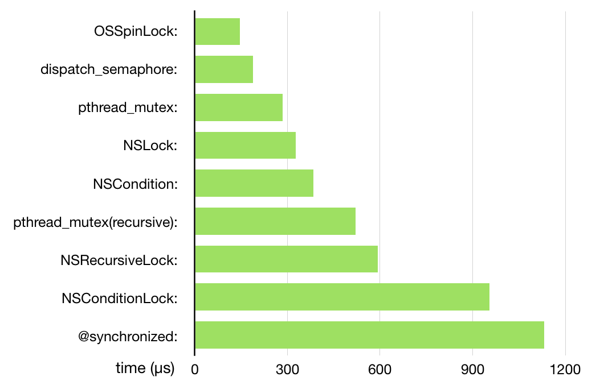

### Lock
-

* 时间片轮转调度算法：操作系统会给每个线程分配一段时间片(100ms左右)，这些线程会被放在一个队列中，CPU只需要维护这个队列，当队首的线程时间片耗尽就会被强制放到队尾等待，然后取下一个队首线程执行。
* 原子操作：不可分割，不可中断的操作。
* 互斥锁：如果一个线程无法获取互斥量，该线程会被直播挂起，不再消耗CPU时间，当其他线程释放互斥量后，系统会激活被挂起的线程。

-

iOS中各种锁的性能对比图，仅供参考


* pthread_mutex_t Example:

    ```
    pthread_mutex_t mutex;
    void MyInitFunction()
    {
        pthread_mutex_init(&mutex, NULL);
    }
     
    void MyLockingFunction()
    {
        pthread_mutex_lock(&mutex);
        // Do work.
        pthread_mutex_unlock(&mutex);
    }
    ```
* @synchronized：The @synchronized directive is a convenient way to create mutex locks on the fly in Objective-C code. 
* 自旋锁：如果一个线程需要获取自旋锁，该锁已经被其他线程占用，该线程不会被挂起，而是不断消耗CPU时间，一直试图获取自旋锁。
* NSLock：只是在内部封装了一个pthread_mutex,属性为PTHREAD_MUTEX_ERRORCHECK,它会损失一定性能换来错误提示。NSLock比pthread_mutex略慢的原因在于它需要经过方法调用。其结构是：

    ```
    @interface NSLock : NSObject <NSLocking> {
    @private
        void *_priv;
    }
    - (BOOL)tryLock;
    - (BOOL)lockBeforeDate:(NSDate *)limit;
    @property (nullable, copy) NSString *name API_AVAILABLE(macos(10.5), ios(2.0), watchos(2.0), tvos(9.0));
    @end
    ```

Example:

```
NSLock *lock = [[NSLock alloc] init];
dispatch_queue_t globalQueue = dispatch_get_global_queue(DISPATCH_QUEUE_PRIORITY_DEFAULT, 0);
dispatch_async(globalQueue, ^{
    [lock lockBeforeDate:[NSDate date]];
    NSLog(@"******需要线程同步的操作1开始******");
    sleep(2);
    NSLog(@"******需要线程同步的操作1结束******");
    [lock unlock];
});
dispatch_async(globalQueue, ^{
    sleep(1);
    //尝试获取锁，如果获取不到返回NO,不会阻塞主线程
    if ([lock tryLock]) {
        NSLog(@"******锁可用的操作******");
        [lock unlock];
    } else {
        NSLog(@"******锁不可用的操作******");
    }
    
    NSDate *date = [NSDate dateWithTimeIntervalSinceNow:3];
    //尝试在未来的3s内获取锁，并阻塞该线程，如果3s内获取不到恢复线程, 返回NO,不会阻塞该线程
    if ([lock lockBeforeDate:date]) {
        NSLog(@"******没有超时，获得锁");
        [lock unlock];
    } else {
        NSLog(@"******超时，没有获得锁");
    }
});
```

* NSRecursiveLock递归锁：它和NSLock的区别在于，NSRecursiveLock可以在一个线程中重复加锁，NSRecursiveLock会记录上锁和解锁的次数，当二者平衡的时候，才会释放锁，其它线程才可以上锁成功。SO,NSRecursiveLock可以被同一个线程多次请求，而不会引起死锁。其结构是：

```
@interface NSRecursiveLock : NSObject <NSLocking> {
@private
    void *_priv;
}
- (BOOL)tryLock;
- (BOOL)lockBeforeDate:(NSDate *)limit;
@property (nullable, copy) NSString *name API_AVAILABLE(macos(10.5), ios(2.0), watchos(2.0), tvos(9.0));
@end
```
Example:

```
NSRecursiveLock *recursiveLock = [[NSRecursiveLock alloc] init];
static void (^recursiveBlock)(int);
recursiveBlock = ^(int value) {
    [recursiveLock lock];
    if (value > 0) {
        NSLog(@"******value : %d******", value);
        recursiveBlock(value - 1);
    }
    [recursiveLock unlock];
};
dispatch_queue_t globalQueue = dispatch_get_global_queue(DISPATCH_QUEUE_PRIORITY_DEFAULT, 0);
dispatch_async(globalQueue, ^{
    recursiveBlock(3);
});
```

* NSConditionLock

> An NSConditionLock object defines a mutex lock that can be locked and unlocked with specific values. You should not confuse this type of lock with a condition (see Conditions). The behavior is somewhat similar to conditions, but is implemented very differently.
Typically, you use an NSConditionLock object when threads need to perform tasks in a specific order, such as when one thread produces data that another consumes. While the producer is executing, the consumer acquires the lock using a condition that is specific to your program. (The condition itself is just an integer value that you define.) When the producer finishes, it unlocks the lock and sets the lock condition to the appropriate integer value to wake the consumer thread, which then proceeds to process the data.
    
    
```
id condLock = [[NSConditionLock alloc] initWithCondition:NO_DATA];
 
while(true)
{
    [condLock lock];
    /* Add data to the queue. */
    [condLock unlockWithCondition:HAS_DATA];
}
```

> Because the initial condition of the lock is set to NO_DATA, the producer thread should have no trouble acquiring the lock initially. It fills the queue with data and sets the condition to HAS_DATA. During subsequent iterations, the producer thread can add new data as it arrives, regardless of whether the queue is empty or still has some data. The only time it blocks is when a consumer thread is extracting data from the queue.

> Because the consumer thread must have data to process, it waits on the queue using a specific condition. When the producer puts data on the queue, the consumer thread wakes up and acquires its lock. It can then extract some data from the queue and update the queue status. The following example shows the basic structure of the consumer thread’s processing loop.


```
while (true)
{
    [condLock lockWhenCondition:HAS_DATA];
    /* Remove data from the queue. */
    [condLock unlockWithCondition:(isEmpty ? NO_DATA : HAS_DATA)];
 
    // Process the data locally.
}
```

Example2 for NSConditionLock


```
static const NSInteger NO_DATA = 0;
static const NSInteger HAS_DATA = 1;
static NSInteger DATA_COUNTER = 0;

@interface ViewController () {
    NSConditionLock *lock;
    NSMutableArray *queue;
}

@end

@implementation ViewController

- (void)viewDidLoad {
    [super viewDidLoad];
    lock = [[NSConditionLock alloc] initWithCondition:NO_DATA];
    queue = [NSMutableArray array];
    [NSThread detachNewThreadSelector:@selector(producerThreadEntryPoint) toTarget:self withObject:nil];
    [NSThread detachNewThreadSelector:@selector(consumerThreadEntryPoint) toTarget:self withObject:nil];
    [NSThread detachNewThreadSelector:@selector(consumerThreadEntryPoint) toTarget:self withObject:nil];
}

- (void)producerThreadEntryPoint {
    while (YES) {
        [lock lock];
        [queue addObject:[NSString stringWithFormat:@"DATA_%ld", (long)DATA_COUNTER++]];
        [lock unlockWithCondition:HAS_DATA];
        sleep(1);
        NSLog(@"produced..............");
    }
}

- (void)consumerThreadEntryPoint {
    while (YES) {
        [lock lockWhenCondition:HAS_DATA];
        NSString *data = queue.lastObject;
        [queue removeLastObject];
        [lock unlockWithCondition:queue.count > 0 ? HAS_DATA : NO_DATA];
        NSLog(@"get data : %@ in thread : %@", data, [NSThread currentThread]);
    }
}

@end
```
-

### Lock types


| Lock | Description |
| --- | --- |
| Mutex | A mutually exclusive (or mutex) lock acts as a protective barrier around a resource. A mutex is a type of semaphore that grants access to only one thread at a time. If a mutex is in use and another thread tries to acquire it, that thread blocks until the mutex is released by its original holder. If multiple threads compete for the same mutex, only one at a time is allowed access to it. |
| Recursive lock | A recursive lock is a variant on the mutex lock. A recursive lock allows a single thread to acquire the lock multiple times before releasing it. Other threads remain blocked until the owner of the lock releases the lock the same number of times it acquired it. Recursive locks are used during recursive iterations primarily but may also be used in cases where multiple methods each need to acquire the lock separately. |
| Read-write lock | A read-write lock is also referred to as a shared-exclusive lock. This type of lock is typically used in larger-scale operations and can significantly improve performance if the protected data structure is read frequently and modified only occasionally. During normal operation, multiple readers can access the data structure simultaneously. When a thread wants to write to the structure, though, it blocks until all readers release the lock, at which point it acquires the lock and can update the structure. While a writing thread is waiting for the lock, new reader threads block until the writing thread is finished. The system supports read-write locks using POSIX threads only. For more information on how to use these locks, see the pthread man page. |
| Distributed lock | A distributed lock provides mutually exclusive access at the process level. Unlike a true mutex, a distributed lock does not block a process or prevent it from running. It simply reports when the lock is busy and lets the process decide how to proceed. |
| Spin lock | A spin lock polls its lock condition repeatedly until that condition becomes true. Spin locks are most often used on multiprocessor systems where the expected wait time for a lock is small. In these situations, it is often more efficient to poll than to block the thread, which involves a context switch and the updating of thread data structures. The system does not provide any implementations of spin locks because of their polling nature, but you can easily implement them in specific situations. For information on implementing spin locks in the kernel, see Kernel Programming Guide. |

### Conditions

> A condition is another type of ==semaphore== that allows threads to signal each other when a certain condition is true. Conditions are typically used to indicate the availability of a resource or to ensure that tasks are performed in a specific order. ==When a thread tests a condition, it blocks unless that condition is already true.== It remains blocked until some other thread explicitly changes and signals the condition. ==The difference between a condition and a mutex lock is that multiple threads may be permitted access to the condition at the same time.== The condition is more of a gatekeeper that lets different threads through the gate depending on some specified criteria.

> One way you might use a condition is to manage a pool of pending events. The event queue would use a condition variable to signal waiting threads when there were events in the queue. If one event arrives, the queue would signal the condition appropriately. If a thread were already waiting, it would be woken up whereupon it would pull the event from the queue and process it. If two events came in to the queue at roughly the same time, the queue would signal the condition twice to wake up two threads.

> The system provides support for conditions in several different technologies. The correct implementation of conditions requires careful coding, however, so you should look at the examples in Using Conditions before using them in your own code.

### Others
#### Perform Selector Routines
> Cocoa applications have a convenient way of delivering messages in a synchronized manner to a single thread. The NSObject class declares methods for performing a selector on one of the application’s active threads. These methods let your threads deliver messages asynchronously with the guarantee that they will be performed synchronously by the target thread. For example, you might use perform selector messages to deliver results from a distributed computation to your application’s main thread or to a designated coordinator thread. ==Each request to perform a selector is queued on the target thread’s run loop and the requests are then processed sequentially in the order in which they were received.==

#### Watch Out for Deadlocks and Livelocks
> ==Any time a thread tries to take more than one lock at the same time, there is a potential for a deadlock to occur.== A deadlock occurs when two different threads hold a lock that the other one needs and then try to acquire the lock held by the other thread. The result is that each thread blocks permanently because it can never acquire the other lock.

> A livelock is similar to a deadlock and occurs when two threads compete for the same set of resources. In a livelock situation, a thread gives up its first lock in an attempt to acquire its second lock. Once it acquires the second lock, it goes back and tries to acquire the first lock again. It locks up because it spends all its time releasing one lock and trying to acquire the other lock rather than doing any real work.

> The best way to avoid both deadlock and livelock situations is to take only one lock at a time. If you must acquire more than one lock at a time, you should make sure that other threads do not try to do something similar.


-
[多线程编程指南](https://developer.apple.com/library/archive/documentation/Cocoa/Conceptual/Multithreading/ThreadSafety/ThreadSafety.html#//apple_ref/doc/uid/10000057i-CH8-124887)


